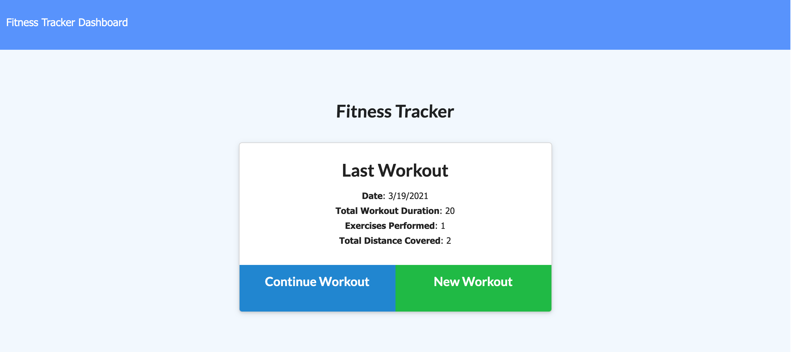
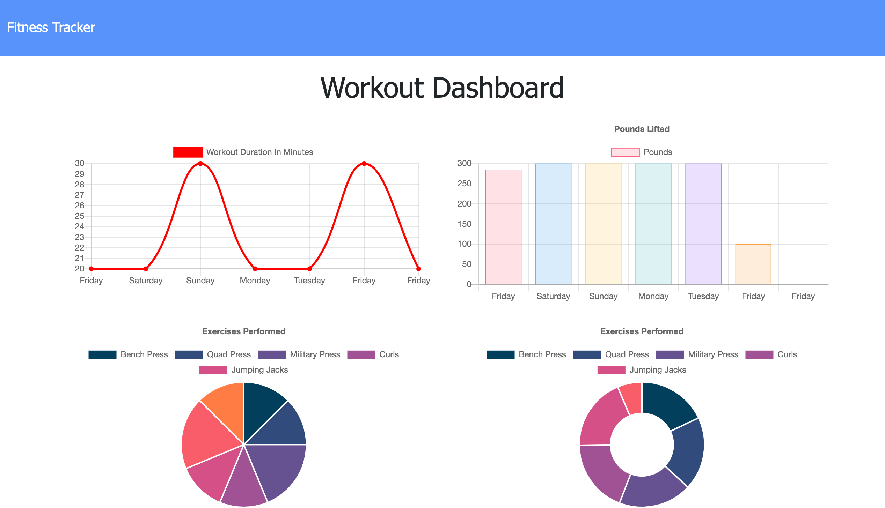

# Fast-Track-Fitness

## Link to webpage
https://fast-track-fitness.herokuapp.com/?id=60543fa00b4c7f84a8384c1c

## Description
As a user, you'll be able to view create and track daily workouts. The user can log multiple exercises in a workout on a given day. They can also track the name, type, weight, sets, reps, and duration of exercise. If the exercise is a cardio exercise, the user is able to track their distance traveled.

## Deployed Website
### Landing Page

### Dashboard 

## Technology Used
* MongoDB
* Mongoose
* JavaScript
* Node.js
* Heroku
* HTML5
* CSS3

## Contributing
Pull requests are welcome. For major changes, please open an issue first to discuss what you would like to change.

## License
[MIT](https://choosealicense.com/licenses/mit/)